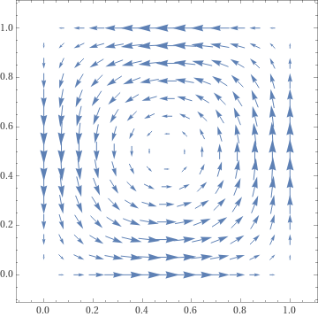

# Discretization Schemes for a Linear Convection Equation

__Description__ This project deals with the simulation of different stabilization schemes for the _Linear Convection Equation_, often also referred to as _Linear Advection_ or _Linear Transport Equation_, for a simple velocity field in two spatial dimensions.

<p align="center">

</p>

__Model__ We consider the Partial Differential Equation with a vector velocity field $v$ and a scalar mass density $c$ given by
$$
\partial_t c + (v \cdot \nabla ) c = 0.
$$

__Domain__ As domain we choose the unit square in two spatial dimensions, $\Omega = \{ (x,y) : 0 \leq x,y \leq 1 \}$

__Velocity Field__ As velocity field we consider one swirl of a [Taylor-Green vortex](https://en.wikipedia.org/wiki/Taylor%E2%80%93Green_vortex) for a fixed time. This velocity field is given by
<p align="center">

</p>

$$
v(x,y) = (-\cos (\pi x +\pi/2) \sin (\pi y +\pi/2), \sin ( \pi x +\pi/2) \cos (\pi y +\pi/2))^T
$$
for $0 \leq x,y \leq 1$. This velocity field fulfills the so called slip boundary conditions
$$
v \cdot \eta_{\partial \Omega} = 0 .
$$


__Discretization__ As discretization we use Finite Differences in time and Finite Elements in space. We consider the following abstract scheme for some discrete function Space $X_h$:
For a given $c^n \in X_h$ we want to find $c^{n+1} \in X_h$ such that
$$
\frac{1}{\Delta t} (c^{n+1} - c^n, w) + a(v,c^{n+\theta},w) + b(v,c^{n+\theta},w) = 0
$$
for all $w\in X_h$ with $c^{n+\theta}= \theta c^{n+1} +  (1- \theta ) c^n$. Thereby $a$ is the discretization of the convection term and $b$ a potential stabilization term. 

## Discretization Schemes
__Convection__ The convection can be discretized in the following ways. 
$$
\begin{aligned}
a(v,c,w) &= 
\int_{ \Omega } w \nabla \cdot (v c) \mathrm{d} x
& \text{(standard formulation)}
\\
a(v,c,w) &= 
\int_{ \Omega } w v\cdot \nabla c \mathrm{d} x
+ \sigma \int_{ \Omega } c  w \nabla \cdot v \mathrm{d} x
& \text{(after application of product rule, $\sigma = 1$ for conservative, $\sigma = 0$ for non-conservative form)}
\\
a(v,c,w) &= 
- \int_{ \Omega } c  v\cdot \nabla w \mathrm{d} x
+ \sum_{ F \in F^i_h } \int_F v\cdot \eta [ c  w] \mathrm{d} s
& \text{(weak formulation, jump terms vanish for a continuous discrete function space)}
\end{aligned}
$$
This is referred to in the command line interface by 
> -cf "strng"

> -cf "prod"

> -cf "weak"

respectively.

__Stabilization terms__ We add the following terms to the form.
$$
\begin{aligned}
b(v,c,w) &=
\alpha \frac{|v| h}{2} (\nabla c , \nabla w)
& \text{(Isotropic Artificial Diffusion)}
\\
b(v,c,w) &=
+ \alpha \frac{ h }{2 |v| } ((v \cdot \nabla) c , (v \cdot \nabla) w)
& \text{(Streamline Upwinding)}
\\
b(v,c,w) &=
+ \alpha \frac{ h }{2 |v| } ((v \cdot \nabla) c , \nabla \cdot (v w))
& \text{(Taylor-Galerkin)}
\\
b(v,c,w) &=
- \sum_{ F \in F^i_h } \int_F v \cdot \eta [ c  ] \langle w \rangle + \frac{ 1 }{ 2 } \sum_{ F \in F^i_h } \int_F | v \cdot \eta | [ c ] [ w ]
& \text{(Upwinding for Discontinuous Galerkin)}
\end{aligned}
$$
This is referred to in the command line interface by 
> -stab "iad"

> -stab "su"

> -stab "tg"

> -stab "dgu"

respectively.
In the case of a _Streamline Upwinding Petrov Galerkin_ called in the command line by

> -stab "supg"

instead of adding a stabilization term, one simply replaces the test function $w$ by
$$
\bar{ w } = w + \tau ( v \cdot \nabla) w 
.
$$


## References

The models in the code are based on the following works:
> [D. Kuzmin, A Guide to Numerical Methods for Transport Equations. Lecture Notes (2010).](https://www.researchgate.net/profile/Mohamed_Mourad_Lafifi/post/How_to_compute_time-varying_temperature_gradient_along_the_diagonal/attachment/5a7cb7f4b53d2f0bba50c83f/AS%3A591864495366149%401518122900805/download/A+Guide+to+Numerical+Methods+for+Transport+Equations.pdf)

> D. A. Di Pietro and A. Ern, Mathematical aspects of discontinuous Galerkin methods. Berlin: Springer (2012; Zbl 1231.65209), Section 3.1.


## Getting Started and Usage

All arguments to run simulations are given via the command line input. To see the options run the following command in the package directory:

```
python -m main -h
```

Another usage example with several arguments:

```
python -m main -cf "prod" -fs "CG" -fso 1 -stab "supg"
```

A preset of the most standard schemes for comparison can be run by:

```
bash runall.sh
```

__Output__ All simulations will output 
* the temporal evolution of the mass density $c$ in a .bp file format,
* the used discretization as a Markdown file
* and a csv containing some basic instationary metrics.


## License

This project is licensed under the MIT License - see the [LICENSE.md](LICENSE.md) file for details

## Authors

> **Maximilian E. V. Reiter**, https://orcid.org/0000-0001-9137-7978

## Requirements

All requirements can be found in the file requirements.txt and can be installed via pip by

```
pip install -r requirements.txt
```

or via conda by

```
conda create --name my-env-name --file requirements.txt -c conda-forge
```